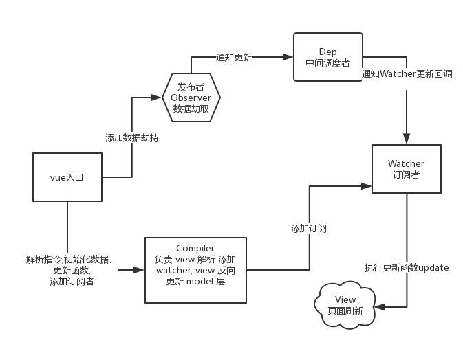

# vue-reactive

> ### 在线预览代码 : https://stackblitz.com/edit/vue-reactive

代码结构很简单，主要分为三个部分
1. Observer 负责监听data属性，添加数据拦截 通知Dep
2. Watcher 接受Dep变更通知 执行Compiler更新回调
3. Dep 负责Obserber Watcher通信 监听Dep更新，触发Watcher的update
4. Compiler 负责view解析 添加watcher

